# 《电子羊会发疯》MVP试玩版架构图

## 1. 说明

本架构图覆盖当前正式实施的 MVP 试玩版：

- `2` 张地图
- `25` 只羊（`001-025`）
- 单货币
- 最小科技集
- 一键合成
- 超频摸鱼
- 本地存档
- 离线收益
- 广告流程抽象

本架构图不覆盖长期运营版、排行榜、免费随机羊、后端和云存档。

实现状态说明（2026-05-17）：

- 当前代码已落地 `issue #2《MVP 工程底座与新档开局》`、`issue #3《第一图自动产出与核心 HUD》` 与 `issue #4《第一图购买、出生点与容量失败反馈》`
- 当前实现工程位于 `Crazy-Electronic-Sheep/`，技术形态为 `Cocos Creator 3.8.8 + TypeScript`
- 当前 Cocos 实现没有额外创建 `Boot Scene`；启动协调由 `MainScene.scene` 上的 `MainSceneController` 触发
- 已实现：`Boot Coordinator`、本地存档读取入口、新档初始化、`map_01` 主场景骨架、双地图最小状态骨架、第一图自动产出、核心 HUD（当前资源 / 全局总秒产 / 羊钻占位数值）、第一图默认 `001` 购买入口、合法出生点分配、容量失败与无出生点失败反馈
- 尚未实现：科技、第二图正式玩法、离线收益、完整地图切换与跨地图解锁流程
- 因此本文件中的其余模块边界应视为当前 MVP 的目标架构，而不是“已全部编码完成”的现状

## 2. 架构图

```mermaid
flowchart TD
    A["Cocos 主场景 MainScene.scene"] --> B["主场景控制器 MainSceneController"]
    B --> C["启动协调器 Boot Coordinator"]
    C --> D["配置加载 Config Loader"]
    C --> E["存档仓库 Save Repository"]
    C --> F0["运行时状态缓存 Runtime Session"]

    B --> F["界面层 UI Layer"]
    B --> G["地图表现层 Map Presentation"]
    B --> H["应用协调层 Game Flow"]

    F --> F1["顶部 HUD"]
    F --> F2["购买区"]
    F --> F3["地图切换入口"]
    F --> F4["科技入口"]
    F --> F5["图鉴入口"]
    F --> F6["离线收益面板"]
    F --> F7["调试入口"]

    G --> G1["第一地图视图 map_01"]
    G --> G2["第二地图视图 map_02"]
    G --> G3["羊实例视图"]
    G --> G4["拖拽与合成反馈"]
    G --> G5["跨地图转场动画"]

    H --> I["状态容器 Game State"]
    H --> J["时间推进服务 Tick Service"]
    H --> K["购买与生成服务 Buy Service"]
    H --> L["招聘机服务 Hiring Machine Service"]
    H --> M["随机走动服务 Roaming Service"]
    H --> N["拖拽交互服务 Drag Service"]
    H --> O["合成服务 Merge Service"]
    H --> P["一键合成服务 Auto Merge Service"]
    H --> Q["点击收益服务 Tap Reward Service"]
    H --> R["科技服务 Tech Service"]
    H --> S["超频服务 Overclock Service"]
    H --> T["地图切换与转场服务 Map Transition Service"]
    H --> U["图鉴服务 Collection Service"]
    H --> V["离线结算服务 Offline Reward Service"]
    H --> W["广告抽象服务 Ad Gateway"]
    H --> X["存档服务 Save Service"]

    C --> Y["配置数据 Config Data"]
    F0 --> I

    I --> I1["全局资源状态"]
    I --> I2["地图状态列表"]
    I --> I3["羊实例状态"]
    I --> I4["解锁与图鉴状态"]
    I --> I5["科技状态"]
    I --> I6["每日次数状态"]
    I --> I7["时间戳与快照状态"]

    J --> I1
    J --> I2
    J --> I3
    K --> I1
    K --> I2
    K --> I3
    L --> I4
    L --> I5
    M --> I2
    M --> I3
    N --> I2
    N --> I3
    O --> I2
    O --> I3
    O --> I4
    P --> I2
    P --> I3
    P --> I4
    Q --> I1
    Q --> I3
    R --> I5
    S --> I1
    S --> I6
    T --> I2
    T --> I4
    U --> I4
    V --> I1
    V --> I6
    V --> I7
    W --> V
    X --> D
    X --> I

    Y --> K
    Y --> L
    Y --> M
    Y --> O
    Y --> P
    Y --> Q
    Y --> R
    Y --> S
    Y --> T
    Y --> V

    F --> H
    G --> H
    H --> F
    H --> G
```

## 3. 模块职责

### 启动层

- `MainScene.scene`
  负责当前 Cocos 项目的场景启动入口，并挂载 `MainSceneController`。

- `Boot Coordinator`
  当前由 `MainSceneController` 在主场景启动时调用，负责按顺序执行配置加载、存档读取、启动校验和新档重建。

- `Runtime Session`
  负责缓存本轮启动后得到的运行时状态，供后续主场景内模块读取。

### 主场景层

- `Main Game Scene`
  负责承载当前 MVP 的全部可视区域与交互入口。

- `UI Layer`
  负责 HUD、购买按钮、地图切换入口、科技入口、图鉴入口、离线收益弹窗、调试入口。

- `Map Presentation`
  负责两张地图视图、羊表现节点、拖拽反馈、合成反馈和跨地图转场动画。

### 应用协调层

- `Game Flow`
  负责接收 UI 与场景输入，并调度各核心服务。

### 核心服务层

- `Tick Service`
  负责按秒推进自动产出，汇总当前所有地图的正式秒产。

- `Buy Service`
  负责当前地图购买、扣费、容量校验、出生点分配和实例生成。

- `Hiring Machine Service`
  负责维护全局招聘机等级，并根据全局最高解锁羊与当前地图内容边界计算可购买范围。

- `Roaming Service`
  负责当前显示地图中的待机、选点、移动、边界约束和左右翻转。

- `Drag Service`
  负责拖拽开始、目标锁定、显示层级提升、释放落点修正和拖拽结束恢复。

- `Merge Service`
  负责拖拽合成判定、跨地图结果投放、`020 -> 021` 解锁转场和 `025` 封顶失败反馈。

- `Auto Merge Service`
  负责当前地图从低到高的递归一键合成。

- `Tap Reward Service`
  负责点击查岗收益与单羊冷却。

- `Tech Service`
  负责最小科技集的等级、数值效果和购买逻辑。

- `Overclock Service`
  负责 `超频摸鱼` 的自动产出倍增与每日次数管理。

- `Map Transition Service`
  负责地图切换入口状态、首次解锁自动跳转和转场期间交互锁。

- `Collection Service`
  负责首次解锁记录与图鉴状态同步。

- `Offline Reward Service`
  负责基于退出时基础全局秒产快照结算离线收益，并生成 `1倍 / 3倍` 领取面板数据。

- `Ad Gateway`
  负责广告流程抽象，对业务层暴露“广告成功/失败”结果；当前阶段可接 mock。

- `Save Service`
  负责存档读写、坏档重建和关键时间点保存。

### 数据层

- `Config Loader`
  负责加载与校验 `001-025` 羊配置、双地图配置、科技配置和外围系统配置。

- `Config Data`
  负责存放静态配置：
  - 两张地图边界与容量
  - `001-025` 羊定义
  - 秒产、购买价、点击倍率
  - 招聘机偏移
  - 科技参数
  - 一键合成冷却
  - 超频参数
  - 离线上限
  - 新档初始资源

- `Save Repository`
  负责本地存储介质读写。

- `Game State`
  负责维护运行期唯一可信状态。

## 4. 核心数据流

### 启动阶段

1. 启动场景进入。
2. 启动协调器加载配置并完成校验。
3. 读取本地存档。
4. 若为空档，按新档规则构建初始状态。
5. 若坏档，按当前坏档重建策略重建新档并标记提示。
6. 准备离线收益结算数据。
7. 进入主游戏场景。

### 运行阶段

1. 时间推进服务每秒汇总所有地图正式秒产并增长全局资源。
2. 当前显示地图运行完整可视走动与交互。
3. 非当前地图不跑可视走动，但继续贡献自动产出。
4. 玩家在当前地图发起购买、拖拽、点击、一键合成、科技升级和地图切换。
5. 应用协调层调用对应服务。
6. 服务更新状态容器。
7. 状态变化驱动 HUD、地图表现、图鉴和离线面板数据刷新。
8. 关键节点触发存档。

### 跨地图解锁阶段

1. 玩家在第一张地图完成 `020 + 020 -> 021`。
2. 合成服务生成 `021` 并标记第二张地图解锁。
3. 地图切换与转场服务播放首次解锁转场动画。
4. `021` 在第二张地图合法出生点落定。
5. 玩家视角自动切到第二张地图。

### 退出与重进阶段

1. 退出前保存关键状态、退出时间和基础全局秒产快照。
2. 下次启动时读取时间戳与快照。
3. 离线结算服务计算离线奖励。
4. 主界面在默认最高已解锁地图打开。
5. 离线收益面板允许玩家选择 `1倍` 或广告 `3倍`。

## 5. 设计原则

- UI 不持有业务真值。
- 当前地图与非当前地图有不同的表现更新策略，但共享同一全局资源真值。
- 所有资源增减都通过统一服务入口完成。
- 招聘机等级全局共享，但每张地图的最终购买结果必须受地图内容边界约束。
- 跨地图边界的羊结果必须落到目标地图，不允许同一只羊同时兼属两个地图。
- 存档只保存长期真值，不保存临时 Buff 剩余时间与临时冷却。
- 转场期间必须锁定交互，但不能冻结自动产出真值。
- 调试入口只作用于开发模式，不进入正式用户流程。

## 6. 本轮明确不进入架构图的模块

- 免费随机羊服务
- 排行榜服务
- 云存档服务
- 后端接口网关
- 活动配置中心
- 第三张及后续地图管理器
- 长期运营资源分包管理器

这些模块后续需要时再挂到应用协调层与数据层，不应提前污染当前 MVP 架构。

## 7. 当前数据与存储结构

### 7.1 当前阶段说明

- 当前阶段没有后端数据库。
- 当前阶段没有服务端账号系统、云存档或排行榜表结构。
- 当前阶段唯一持久化介质是本地存档。
- 广告流程当前只要求接口抽象与 mock，不要求真实 SDK 接入。

### 7.2 当前本地存档结构

当前本地存档至少应包含以下字段分组：

- 存档版本信息
- 当前摸鱼能量
- 全局最高解锁羊编号
- 已解锁羊编号列表
- 图鉴状态
- 第二张地图解锁状态
- 科技等级状态
- 招聘机等级
- 两张地图的羊实例列表
- 每日次数状态
- 上次退出时间戳
- 退出时基础全局秒产快照
- 必要的运行恢复字段

### 7.3 地图状态最小字段

每张地图至少应包含：

- 地图标识
- 当前羊实例列表
- 地图是否已解锁
- 地图起始羊编号
- 地图上限羊编号

### 7.4 羊实例存档字段

每个羊实例至少应包含：

- 实例唯一标识
- 所属地图标识
- 羊编号
- 当前等级
- 当前位置
- 当前朝向
- 当前走动状态
- 当前目标点
- 当前待机剩余时间或下一次状态切换信息
- 单羊点击冷却相关恢复字段

### 7.5 不应写入存档的内容

以下内容不应作为持久化真值写入：

- 可从配置重新读取的静态羊配置
- 可从配置重新读取的购买价格定义
- 可从配置重新读取的地图边界定义
- 纯表现层节点状态
- `超频摸鱼` 剩余时间
- 一键合成剩余冷却
- 可通过运行时重新计算出的临时缓存

## 8. 架构更新规则

- 每完成一个重大功能或里程碑后，必须更新本文件。
- 如果模块边界、双地图数据流、存档结构、临时状态规则发生变化，必须先更新本文件，再继续后续开发。
- 如果代码实现与本文件冲突，必须以“先修正文档或先修正设计”为前置动作，不能长期失配。
## 9. 褰撳墠涓诲満鏅礌鏉愭帴鍏ヨ鏄庯紙2026-05-17锛?

- `MainSceneController` 褰撳墠鍦?`MainScene.scene` 鍚姩鍚庝細鍏堝畬鎴?boot锛岀劧鍚庨€氳繃 `resources.load(.../spriteFrame)` 鍔犺浇 `map_01` 鐪熷疄鑳屾櫙鍥惧拰 `001` 缇婅创鍥俱€?
- `map_01` 鐨勭湡瀹炶儗鏅浘璧勬簮浣嶄簬 `Crazy-Electronic-Sheep/assets/resources/map_01/map_01_background.png`锛?`001` 缇婄礌鏉愯祫婧愪綅浜?`Crazy-Electronic-Sheep/assets/resources/sheep/sheep_001.png`銆?
- `sheep_001.png` 鏄粠鐢ㄦ埛鎻愪緵鐨?`001瀹炰範缇?.png` 鐢熸垚鐨勫睍绀鸿祫浜э紝宸插皢涓庡浘鍍忚竟缂樼浉杩炵殑鐧借壊鑳屾櫙鍖哄煙杞负閫忔槑锛岄伩鍏嶄富鍦烘櫙鍑虹幇鐧藉簳鏂规銆?
- 褰撳墠鍦烘櫙鍙槸鈥滅湡瀹炶儗鏅?+ 1 鍙?001 灞曠ず鈥濈殑 MVP 琛ㄧ幇灞傦紝杩樻病杩涘叆婕父銆佽喘涔般€佹嫋鎷藉悎鎴愩€佺浜屽浘鐜╂硶鍜岀绾挎敹鐩婇€昏緫銆?

## 10. 2026-05-17 issue #3 更新

- `MainSceneController` 当前在 boot 成功后直接启动最小自动产出轮询，并按整秒推进 `摸鱼能量`。
- 当前自动产出只基于已落地羊配置里的基础秒产定义，不接入购买、科技、点击收益、第二图或离线收益修正。
- 当前主场景顶部 HUD 已切换为 3 个核心信息位：
  - 当前资源
  - 全局总秒产
  - 羊钻占位数值
- `最高解锁羊` 当前仍保留在业务状态与测试快照中，但不再显示在钻石面板底部小字区域。
- 第一图赠送羊在每次整秒结算自动产出时，会在羊头顶播放“摸鱼能量图标 +x”的上浮淡出反馈。
- 当前自动产出轮询会把最新资源真值同步写回本地存档。
- 为避免 Cocos 预览热刷新残留旧轮询导致重复加资源，主场景控制器增加了“当前 owner 才能推进自动产出”的保护。

## 11. 2026-05-18 issue #4 更新

- 第一图已接入最小购买公共接口 `buySheepOnCurrentMap`，当前切片只开放 `map_01` 的默认 `001` 购买，不提前实现招聘机范围扩展。
- `GAME_CONFIG` 已补齐第一图/第二图的固定容量、合法出生点列表和基础购买价字段，购买服务只读取这些静态配置，不把规则写进 UI。
- 新档赠送羊与后续购买羊统一占用正式出生点；羊实例存档字段补齐了 `position` 与 `source`，并将 `saveVersion` 提升到 `2`。
- 购买成功时会扣除 `摸鱼能量`、生成 `purchase-map_01-001-xx` 实例，并把新羊放到当前地图下一个空闲出生点。
- 当第一图达到容量上限、没有合法出生点，或资源不足时，购买会返回明确失败原因，并保持资源、地图实例和解锁状态无副作用。
- 主场景新增最小“招聘”按钮与招聘弹窗；购买按钮调用公共接口后会刷新 HUD、地图羊群渲染和文本反馈，不直接修改底层状态。

## 12. 2026-05-18 主场景组件化重构进展

- `MainSceneController` 仍然是 `MainScene.scene` 上的启动与应用协调入口，但不再直接持有顶部 HUD 与地图羊群的全部子节点细节。
- 顶部 HUD 已拆为 `MainSceneHudView` 运行时组件，负责创建和刷新当前资源、全局总秒产、羊钻占位数值三类展示节点。
- 第一图羊群表现已拆为 `MainSceneMapSheepLayerView` 运行时组件，负责当前第一图羊实例节点渲染、羊影子、羊贴图加载缓存和自动产出飘字反馈。
- 招聘入口与招聘弹窗已拆为 `MainSceneRecruitmentPanelView` 运行时组件，负责招聘按钮、弹窗遮罩、招聘卡片、翻页占位、容量文案和招聘反馈展示；购买业务仍由 `MainSceneController` 调用领域服务执行。
- 通用 UI 节点创建能力已抽到 `uiNodeFactory`，为后续把招聘弹窗、图鉴、科技面板继续拆成独立 Cocos 组件提供共用基础。
- 本轮重构不改变存档结构、不改变购买规则、不改变自动产出规则，只调整表现层模块边界。

## 13. 2026-05-19 自动产出与存档服务拆分

- 自动产出轮询已从 `MainSceneController` 拆为 `MainSceneIdleProductionLoop` 运行时组件；该组件负责 `schedule/unschedule`、整秒补齐、热刷新 owner token 保护、调用领域层 `settleIdleProduction`，并通过回调把新状态交回主场景协调者。
- `MainSceneController` 不再直接保存自动产出的最近结算时间戳，也不再直接持有轮询 owner token；控制器只负责启动自动产出组件、接收结算结果、刷新 HUD 和触发当前地图羊群飘字。
- 当前主游戏本地存档 key 已集中到 `gameStateSaveService`；主场景 boot、清档、购买成功和自动产出写回都通过这个服务读写，避免 UI/协调层到处直接拼 `GAME_CONFIG.storageKey`。
- 本轮没有改变 `GameState` 持久化结构、自动产出数值规则、购买规则或离线收益边界；变化只发生在应用协调层、运行时组件边界和存档服务入口。

## 14. 2026-05-19 主场景基础视图拆分

- 主场景基础布局已从 `MainSceneController` 拆为 `MainSceneFoundationView` 运行时组件；该组件负责 Canvas/Camera 尺寸同步、兜底背景、`map_01` 背景贴图、HUD 根节点、羊贴图锚点、顶部提示文案、测试清档按钮和启动失败画面。
- `MainSceneController` 不再直接持有背景资源路径、设计分辨率、布局缩放、基础 UI 节点创建包装或 `resources.load` 背景加载逻辑；这些表现层细节集中在基础视图组件中。
- `MainSceneController` 当前继续保留启动协调、业务状态写入、招聘购买入口、自动产出回调和各运行时组件装配职责；后续可继续把招聘购买流程与格式化展示工具拆到更小模块。
- 本轮不改变存档结构、玩法规则、资源数值或已接入素材，只调整主场景表现层与协调层的职责边界。

## 15. 2026-05-19 主场景组件挂载方式调整

- `MainScene.scene` 的 `ContentRoot` 现在不只挂载 `MainSceneController`，还直接挂载 `MainSceneFoundationView` 与 `MainSceneIdleProductionLoop`。
- `MainSceneController` 通过 Cocos `@property` 序列化字段引用上述两个组件；运行时仍保留 `getComponent/addComponent` 兜底，避免旧场景资产或手动解绑时启动失败。
- `ContentRoot` 下已新增 `WorldRoot` 与 `ScreenUiRoot` 两个一级根节点，用于区分“随游戏世界内容组织的节点”和“固定在手机屏幕 UI 上的节点”。
- `WorldRoot` 下已预挂载 `BackgroundRoot`、`SheepArtAnchor` 和 `MapSheepLayerRoot`；背景、羊锚点和地图羊群表现层都属于地图/世界内容。
- `ScreenUiRoot` 下已预挂载 `CoreHudRoot`、`SheepStatusRoot`、`DebugControlsRoot` 和 `RecruitmentPanelRoot`；HUD、顶部提示文案、调试入口和招聘弹窗都属于屏幕 UI。
- `MainSceneFoundationView` 通过 `@property` 引用 `WorldRoot`、`ScreenUiRoot` 以及基础视图根节点，不再依赖 `removeAllChildren()` 重建整棵主场景节点。
- `CoreHudRoot` 已直接挂载 `MainSceneHudView`；其下已预挂载 `IdleEnergyHud`、`HighestUnlockedHud`、对应贴图挂点、`IdleEnergyHudSprite`、`HighestUnlockedHudSprite`、文本层以及 `IdleEnergyValueLabel`、`GlobalIdleEnergyPerSecondValueLabel`、`SheepDiamondValueLabel` 三个 `cc.Label` 节点。
- `MainSceneHudView` 通过 `@property` 引用这些 HUD 内部节点、Label 组件、摸鱼能量 HUD 面板 `SpriteFrame` / `Sprite` 和羊钻 HUD 面板 `SpriteFrame` / `Sprite`；运行时只负责按设备尺寸同步位置/尺寸、刷新文本并更新已绑定图片节点。
- `SheepStatusRoot` 下已直接挂载 `MainSceneStatusView`，并预挂载纯文字 `SheepStatusLabel`；顶部提示的文本更新、显隐控制与“停留后上浮淡出”动画已从 `MainSceneFoundationView` 拆到独立状态组件中，基础视图只保留根节点挂载与兜底装配职责。
- `DebugControlsRoot` 下已直接挂载 `MainSceneDebugControlsView`，并预挂载 `ClearSaveButton` 与 `ClearSaveButtonLabel`；按钮位置、尺寸和文字节点由 Cocos 场景承载，组件只负责旧场景缺节点兜底、根据当前节点尺寸用 `Graphics` 重画圆角底板，以及把点击回调转发给主场景控制器的清档逻辑。
- `MainSceneFoundationView` 已通过 `@property(SpriteFrame)` 和 `@property(Sprite)` 绑定 `map_01` 背景图；`BackgroundArtLayer` 与 `Map01BackgroundSprite` 已进入场景层级面板，如果旧场景未绑定这些字段，仍会使用原 `resources.load` 路径兜底，保证旧场景预览不中断。
- `MapSheepLayerRoot` 和 `RecruitmentPanelRoot` 分别直接挂载 `MainSceneMapSheepLayerView` 与 `MainSceneRecruitmentPanelView`；`MainSceneController` 通过 `@property` 引用这两个表现组件，不再默认运行时创建它们。
- `RecruitmentPanelRoot` 下已继续预挂载招聘入口与弹窗的稳定子节点：`RecruitButton`、`RecruitmentModalRoot`、`RecruitmentModalMask`、`RecruitmentPanel`、`RecruitmentPanelFrame`、`RecruitmentTitleSprite`、`RecruitmentCloseButton`、双招聘卡、翻页按钮、页码指示器和容量文案；底部独立反馈文案已移除，招聘结果统一走主场景顶部提示。`MainSceneRecruitmentPanelView` 运行时只负责显隐切换、按钮回调、容量文字与卡片文本刷新、动态卡面资源更新和旧场景缺节点兜底。
- `MainSceneController` 的场景层查找已支持递归查找，并且只在节点缺少父级时才兜底挂回 `ContentRoot`，避免破坏 Cocos 层级面板中已经组织好的 `WorldRoot` / `ScreenUiRoot` 父子关系。
- `MainSceneFoundationView` 的清理边界已进一步收紧为“只清理基础视图自己管理的运行时临时节点，保留场景预挂载子节点”；当前基础视图不再靠节点名字白名单判断哪些该保留，而是统一依赖 `uiNodeFactory` 为运行时代码创建的 fallback 节点打标，再由 `clearManagedRootChildren(...)` 只清 direct child 里带标记的节点。这样 HUD、顶部提示文本、清档按钮和招聘弹窗稳定结构都不会在 rebuild 时被运行时代码误删。
- 当前切片仍保留运行时兜底：如果旧场景资产缺少上述节点或组件，控制器和基础视图会按同名节点查找或临时创建，保证预览不中断。
- 本轮不改变 `GameState` 持久化结构、业务规则、资源数值或本地存档兼容性。
## 2026-05-20 issue #5 架构更新：第一图自由漫游与等级可视区分

- `GAME_CONFIG.roaming` 新增当前表现层漫游配置，集中保存 `map_01` / `map_02` 连续坐标边界、停顿时间范围、移动距离范围、移动速度和到达半径。
- `sheepRoamingService.ts` 新增纯数据漫游状态机：`createInitialSheepRoamingState` 负责从业务羊实例创建表现状态，`stepSheepRoamingState` 负责按 `deltaSeconds` 推进停顿、选点、移动、到达和左右朝向。
- 漫游状态是当前场景表现态，不属于本地存档真值；存档仍只保存羊实例的长期业务落点 `position`，避免把每帧临时目标、停顿剩余时间或朝向写入长期进度。
- `MainSceneMapSheepLayerView` 负责消费漫游状态机并移动 Cocos 节点，保持 `MainSceneController` 只承担启动、状态协调和组件装配职责。
- 等级可视区分同样由 `sheepRoamingService.ts` 内的 `createSheepVisualStyle` 统一产出，当前使用分段色调和渐进体型，不额外显示头顶编号徽标，也不提前实现拖拽、点击查岗、第二图或科技扩展。
- `sheep_001` 基础素材原始朝向面向左，因此 `sheepRoamingService.ts` 通过 `getSheepSpriteScaleX` 把业务朝向映射为贴图缩放：向右移动使用 `scaleX=-1` 镜像，向左移动保持 `scaleX=1`。
- `map_01` 的出生点与漫游边界已统一收进围栏内圈：出生点保持在 `[-200, 200] x [-280, 260]` 范围内，漫游边界保持在 `[-220, 220] x [-300, 280]` 范围内，避免羊贴近栅栏或移动到屏幕外。
- 漫游状态机在创建初始表现态和逐帧推进前都会把位置夹回当前地图边界，兼容旧存档里仍保留旧出生点坐标的羊实例。
- 为避免每次重新进入游戏时羊群重新排成整齐出生点队列，初始漫游表现位置会在进入本轮场景时直接从当前地图完整可移动边界中随机抽取；该位置只属于表现层，不写入本地存档，避免为了“退出时位置”引入频繁写档和退出生命周期边界。
