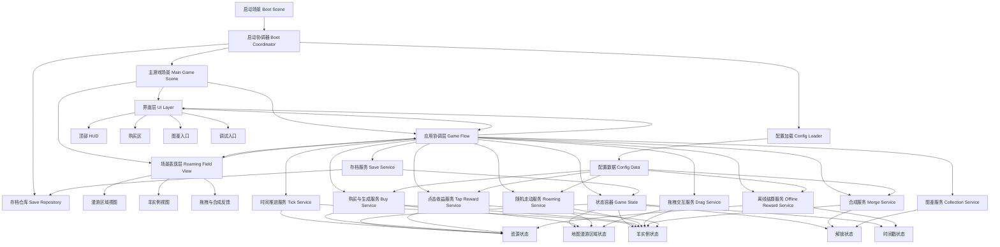

# 《电子羊会发疯》基础游戏架构图

## 1. 说明

本架构图只覆盖基础游戏闭环，不覆盖第二地图、科技、广告、排行榜、后端和长期运营模块。

## 2. 架构图

## 3. 模块职责

### 启动层

- `Boot Scene`
  负责项目启动入口。

- `Boot Coordinator`
  负责按顺序执行配置加载、存档读取、启动校验和进入主场景。

### 主场景层

- `Main Game Scene`
  负责承载基础游戏全部可视区域。

- `UI Layer`
  负责按钮、资源显示、图鉴入口、调试入口等界面交互。

- `Roaming Field View`
  负责漫游区域显示、羊显示、拖拽表现和反馈动画占位。

### 应用协调层

- `Game Flow`
  负责接收 UI 与场景输入，并调度各个服务。

### 核心服务层

- `Tick Service`
  负责自动产出与时间推进。

- `Buy Service`
  负责购买、扣费、判定活动羊数量上限和生成基础羊。

- `Roaming Service`
  负责随机选点、待机与移动切换、边界约束，以及根据移动方向左右翻转单贴图。

- `Drag Service`
  负责拖拽开始、拖拽中暂停走动、释放落点修正，以及拖拽结束后恢复走动。

- `Merge Service`
  负责拖拽后的合成判定、升级结果和状态更新。

- `Tap Reward Service`
  负责点击查岗收益与单羊冷却。

- `Collection Service`
  负责首次解锁记录与图鉴状态同步。

- `Offline Reward Service`
  负责根据退出时间和秒产补发离线收益。

- `Save Service`
  负责在合适时机将关键状态写入本地存档。

### 数据层

- `Config Loader`
  负责加载和校验基础配置。

- `Config Data`
  负责存放基础羊配置、秒产、购买价、点击倍率、地图边界、最大活动羊数量、行走速度、待机时长、离线上限等静态数据。

- `Save Repository`
  负责读写本地存档介质。

- `Game State`
  负责维护运行期唯一可信状态。

## 4. 核心数据流

### 启动阶段

1. 启动场景进入。
2. 启动协调器先加载配置。
3. 配置通过后读取本地存档。
4. 构建初始状态。
5. 进入主游戏场景。

### 运行阶段

1. 时间推进服务按当前羊实例总秒产增长资源。
2. UI 层刷新资源和秒产显示。
3. 随机走动服务驱动羊在地图内待机、选点和移动。
4. 玩家发起购买、拖拽、点击等操作。
5. 应用协调层调用对应服务。
6. 服务更新状态容器。
7. 状态变化驱动界面和地图重绘。
8. 关键节点触发存档。

### 退出与重进阶段

1. 退出前保存关键状态和时间戳。
2. 下次启动时读取时间戳。
3. 离线结算服务按规则补发收益。
4. 主界面展示更新后的资源状态。

## 5. 设计原则

- UI 不持有业务真值。
- 配置与运行状态分离。
- 所有资源增减都通过统一服务入口完成。
- 地图漫游边界与羊实例是两个层次，不能混成同一种数据。
- 羊的自主走动必须可暂停、可恢复，确保拖拽与合成交互稳定。
- 存档只保存必要状态，不保存可由配置还原的静态数据。
- 调试入口只作用于开发模式，不进入正式用户流程。

## 6. 本轮明确不进入架构图的模块

- 第二地图管理器
- 科技树服务
- 广告服务
- 排行榜服务
- 云存档服务
- 活动配置中心
- 后端接口网关
- 资源分包管理器

这些模块后续需要时再挂到应用协调层与数据层，不应提前污染基础游戏架构。

## 7. 当前数据与存储结构

### 7.1 当前阶段说明

- 当前阶段没有后端数据库。
- 当前阶段没有服务端账号系统、云存档或排行榜表结构。
- 当前阶段唯一持久化介质是本地存档。
- 如果未来引入后端或数据库，必须先更新本文件，再开始实现相关代码。

### 7.2 当前本地存档结构

当前本地存档至少应包含以下字段分组：

- 存档版本信息
- 当前摸鱼能量
- 当前最高解锁羊编号
- 已解锁羊编号列表
- 羊实例列表
- 上次退出时间戳
- 必要的运行恢复字段

### 7.3 羊实例存档字段

每个羊实例至少应包含：

- 实例唯一标识
- 羊编号
- 当前等级
- 当前位置
- 当前朝向
- 当前走动状态
- 当前目标点
- 当前待机剩余时间或下一次状态切换信息

### 7.4 不应写入存档的内容

以下内容不应作为持久化真值写入：

- 可从配置重新读取的静态羊配置
- 可从配置重新读取的购买价格定义
- 可从配置重新读取的地图边界定义
- 纯表现层节点状态
- 可通过运行时重新计算出的临时缓存

## 8. 架构更新规则

- 每完成一个重大功能或里程碑后，必须更新本文件。
- 如果模块边界、数据流、存档结构、平台结构发生变化，必须先更新本文件，再继续后续开发。
- 如果代码实现与本文件冲突，必须以“先修正文档或先修正设计”为前置动作，不能长期失配。
